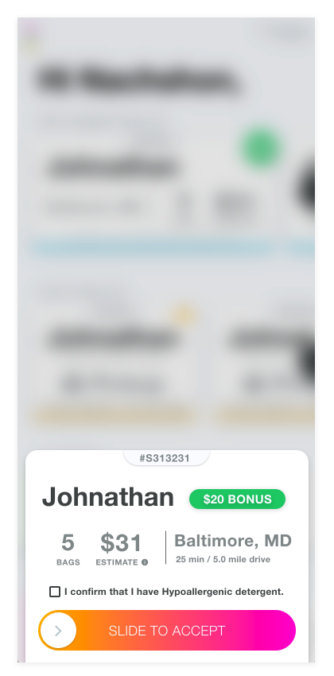

Create simple ion-button, and when the user clicks on it, open a sliding up modal that looks and
 works exactly like this: 
 
 
 
 Make sure the "Slide to Accept" button works and if a user tries to slide it without first
  checking off the checkbox, the checkbox should shake.

### Build locally

    npm i -g ionic
    npm i
    ionic serve  

### Run on device

    npm i -g cordova cordova-res native-run
    ionic cordova build ios
